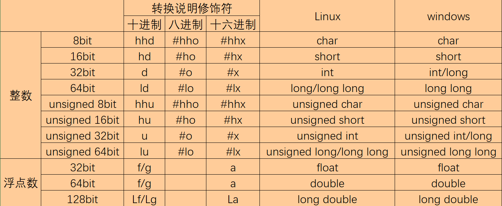

# DataStructure__C
一、数据

1. 基本数据类型

可使用sizeof()以字节为单位获得对象的大小

2. 复合数据类型

    1. 数组（Array）

       1. 概念：数组是同类型数据元素的有序序列，其中的数据元素存储在一段连续的存储单元中，数组名即数组首元素的地址
       2. 声明与初始化：

       `type array_name[item_num];//分配item_num个type类型的内存`

       `type array_name[item_num]={item_1,item_2,...,item_num};`

       3. 访问数据元素

       使用索引访问数组元素`array_name[i]`

       4. 字符串（String）

          1. 概念：一个或多个字符的序列。使用字符型数组存储，在字符的末尾添加`\0`标记字符串的结束
          2. 声明与初始化：

          同数组`char str[num];`

          `char str[num] = {'a','b','c'}`

          `char str[num] = "string"`

          3. 字符串长度=字符数量（不含末尾空字符）=strlen(str)
          4. 字符数组大小=字符数组内存数量=sizeof(str)=num
          5. 字符串函数<string.h>
             1. strlen()

3. 数据结构

2.1 指针

​	概念：指针是一个值为内存地址的变量（该内存地址为数据在内存中第一个二进制位的标识）

​	声明指针：`type * pointer_name = &var;`

​	`&`获得变量的地址，`*pointer获得数据的值`，`type*`表示变量是一个type类型的指针，

​	作为参数传递：即传递`var`的地址，形式上即传递pointer_name

C把函数库中相关的函数归为一类，为每类函数提供一个头文件
